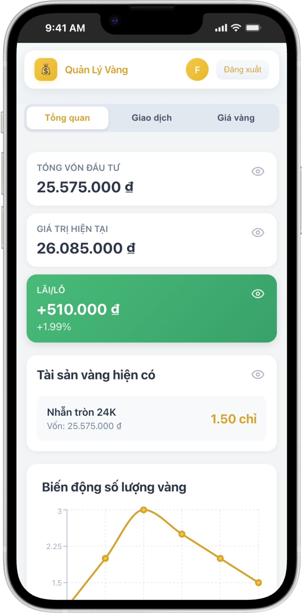
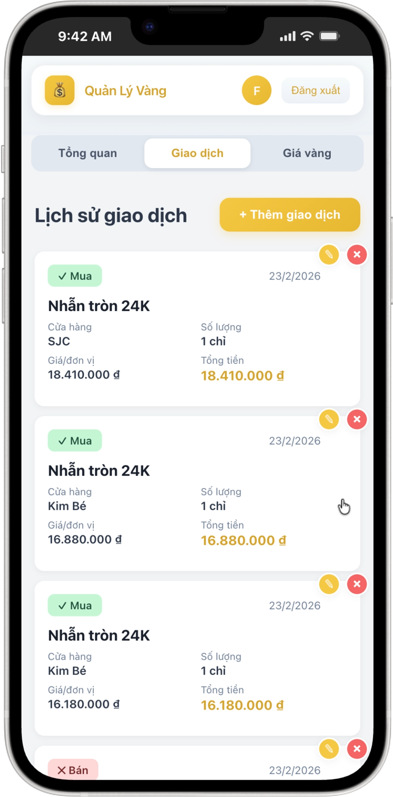
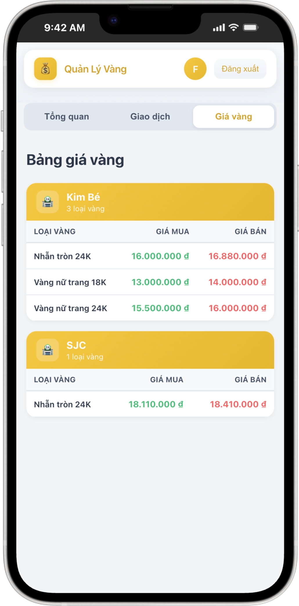

# 💰 Gold Investment Tracker

A modern web application for tracking gold investments with real-time profit/loss calculations.

## ✨ Features

- 📊 **Dashboard**: View total investment, current value, and profit/loss
- 📈 **Charts**: Interactive line chart showing gold quantity trends over time
- 📝 **Transaction Management**: Track buy/sell transactions with smart defaults
- 💵 **Price Updates**: Store-specific gold pricing from different shops
- 👁️ **Guest Mode**: View gold prices without registration
- 🔒 **Permission Control**: Role-based price update access
- 📱 **PWA Support**: Install as app on iOS/Android home screen
- 🎨 **Modern UI**: Gold-themed, responsive interface optimized for mobile
- 🔔 **Toast Notifications**: User-friendly success/error messages
- 👥 **Multi-user Support**: Share with family members

## 📸 Screenshots

### Login Screen


*Login with account or browse as guest - no registration needed to view gold prices*

### Dashboard


*Investment overview with trend charts and detailed analytics*

### Transaction Management


*Track, add, and edit buy/sell gold transactions*

### Gold Price List


*View gold prices grouped by store with real-time updates*

## 🛠️ Tech Stack

- **Frontend**: React 18 with Vite
- **Charts**: Recharts for data visualization
- **Database**: Supabase (PostgreSQL)
- **Authentication**: Supabase Auth
- **Styling**: Inline CSS with modern design
- **Testing**: Vitest + React Testing Library

## 📦 Project Structure

```
gold-tracker/
├── index.html                 # HTML entry point
├── package.json               # Dependencies
├── vite.config.js             # Vite configuration
├── supabase-schema.sql        # Database schema
├── public/                    # Static assets
│   ├── manifest.json          # PWA manifest
│   └── icon-*.png             # App icons
├── src/
│   ├── main.jsx               # React entry point
│   ├── App.jsx                # Main app component
│   ├── components/            # UI components
│   │   ├── Auth/              # Login/signup
│   │   ├── common/            # Shared components
│   │   ├── Dashboard/         # Dashboard & charts
│   │   ├── Transactions/      # Transaction list/forms
│   │   └── PriceList/         # Price management
│   ├── hooks/                 # Custom React hooks
│   ├── services/              # API services
│   ├── utils/                 # Helper functions
│   └── constants/             # App constants
└── README.md                  # This file
```

## 🚀 Quick Start

### 1. Setup Supabase

1. Create account at [supabase.com](https://supabase.com)
2. Create new project
3. Run SQL schema from `supabase-schema.sql`
4. Get API URL and anon key from Settings → API

### 2. Configure App

Create `.env` file in project root:

```env
VITE_SUPABASE_URL=YOUR_SUPABASE_URL
VITE_SUPABASE_ANON_KEY=YOUR_SUPABASE_ANON_KEY
```

### 3. Install & Run

```bash
npm install
npm run dev
```

Visit `http://localhost:3000`

## 📊 Database Schema

### Main Tables

- **stores**: Gold shops/dealers
- **gold_types**: Types of gold (24K, 18K, SJC bars, etc.)
- **transactions**: Buy/sell history
- **store_prices**: Current gold prices at each store
- **family_groups**: Family sharing (optional)

### Security

- Row Level Security (RLS) enabled
- Users can only access their own transactions
- Family groups for data sharing

## 🎨 UI Design

Modern gold-themed design with:
- Gold gradients (#F5C842 → #E6B730) for primary elements
- Clean card-based layouts
- Mobile-first responsive design
- Smooth transitions and hover effects
- Vietnamese number formatting (18.110.000 ₫)

## 📱 Usage

### Add Transaction

1. Go to "Giao dịch" tab
2. Click "+ Thêm giao dịch"
3. Fill in details (type, gold type, quantity, price, date)
4. Click "Lưu giao dịch"

### Update Prices

1. Go to "Giá vàng" tab
2. Click "+ Cập nhật giá"
3. Select store and gold type
4. Enter buy/sell prices
5. Click "Cập nhật giá"

### View Summary

Dashboard shows:
- Total investment amount
- Current value based on latest prices
- Profit/Loss (amount and percentage)
- Holdings breakdown by gold type

## 🌐 Deployment

### Vercel (Recommended)

```bash
npm install -g vercel
vercel
```

### Netlify

```bash
npm run build
# Upload 'dist' folder to Netlify
```

## 🔒 Security Notes

- Never commit API keys to git
- Use environment variables for production
- Enable email confirmation in Supabase Auth
- Keep Supabase RLS policies updated

## 📈 Supabase Free Tier Limits

- Database: 500MB
- Storage: 1GB  
- Monthly Active Users: Unlimited
- API requests: Unlimited

Perfect for personal/family use!

## 🔮 Future Enhancements

- [x] Charts and analytics ✅
- [x] PWA/Mobile support ✅
- [ ] Excel export
- [ ] Price change notifications
- [ ] Dark mode
- [ ] Automatic price fetching from gold websites

## 📝 License

MIT License - Feel free to use and modify!

## 🤝 Contributing

Contributions welcome! Please:
1. Fork the repo
2. Create feature branch
3. Commit changes
4. Push to branch
5. Open Pull Request

## 📞 Support

For issues or questions:
- Check the Vietnamese guide: `HUONG-DAN.md`
- Review Supabase documentation
- Check browser console for errors

---

**Made with ❤️ for gold investors**
